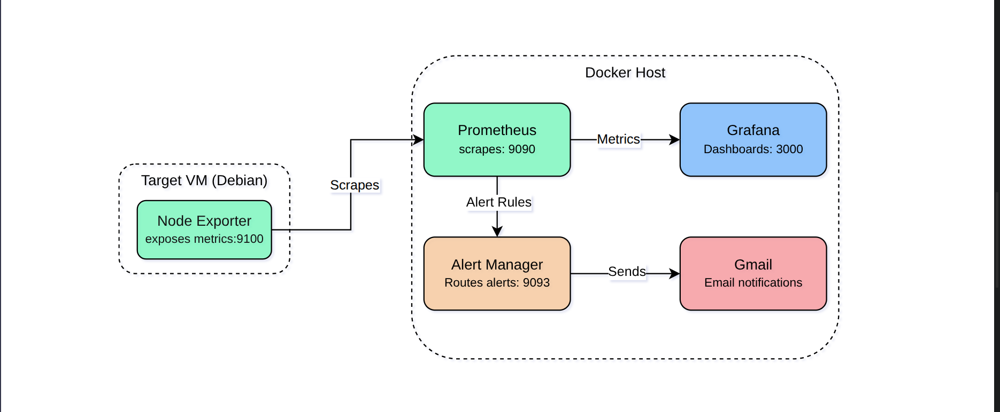
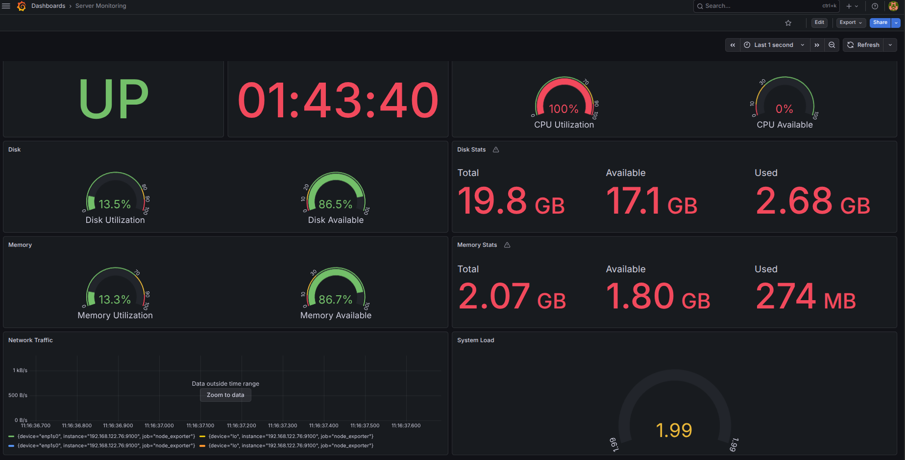
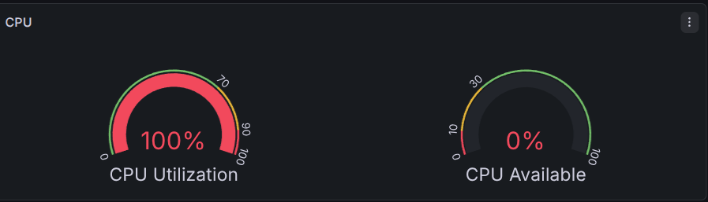
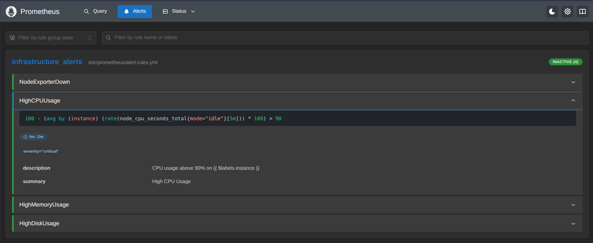
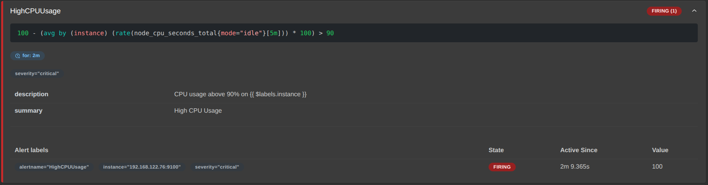
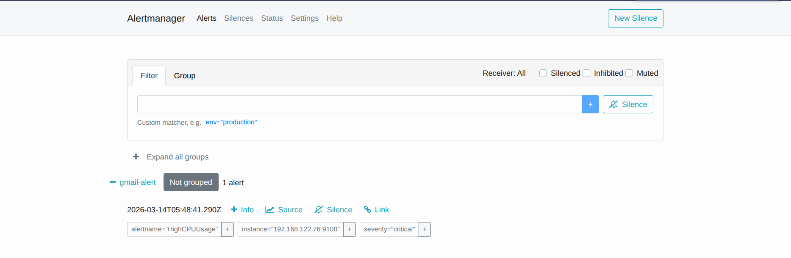
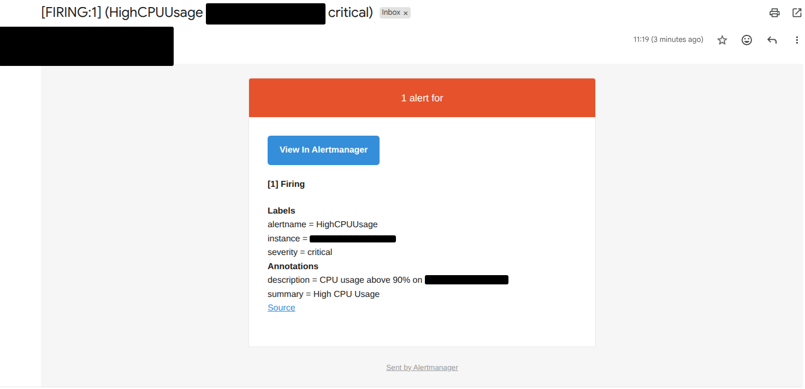
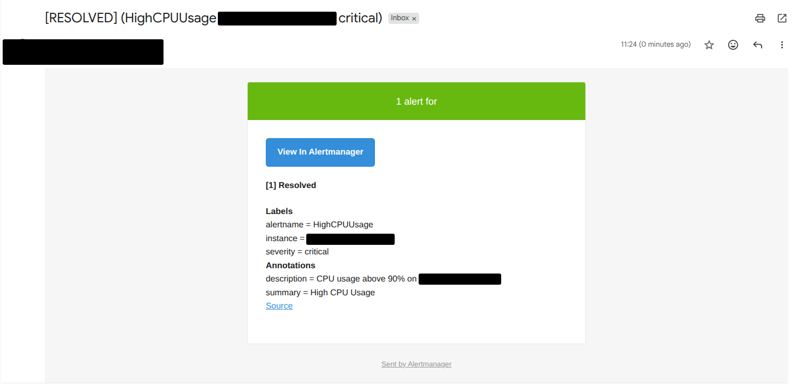

# Infrastructure Monitoring System (Prometheus + Grafana)

A production-style infrastructure monitoring system built using **Prometheus, Grafana, Alertmanager, and Node Exporter**.

This project demonstrates how to monitor Linux servers, visualize metrics, and trigger alerts when system resources cross defined thresholds.

---

# Architecture

---

## Tech Stack
- **Prometheus** - Metrics collection & storage
- **Grafana** - Visualization & dashboards
- **Alertmanager** - Alert routing & notifications
- **Node Exporter** - Linux system metrics

---

## Dashboard
### Server Monitoring Overview

---

## Alerting

### High CPU Utilization (Grafana)

### Alert Rules (Prometheus)

### Alert Firing state (Prometheus)

### Alerts in Alertmanager

### Email Notifications

